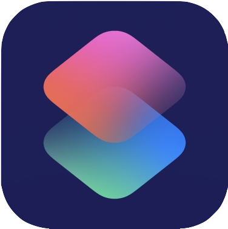
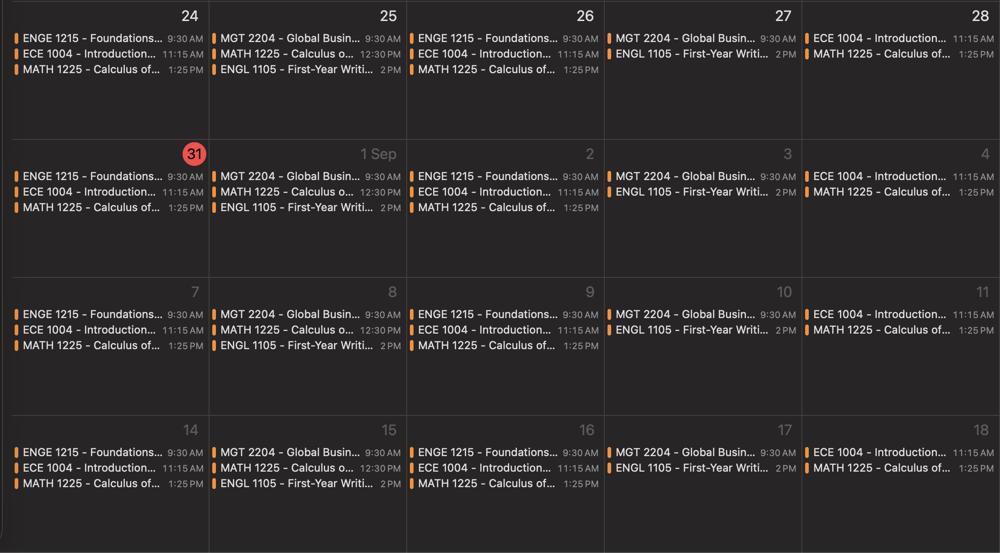

# Add Schedule To Calendar Shortcut

**Get the Shortcut** 

[V1](https://www.facebook.com/groups/nhomgianghotranhba/permalink/1975433056477230/)

Upload a PDF of your class schedule, and this shortcut generates it on Apple Calendar.

## Setup

1. **Get a free Gemini API key** at [Google AI Studio](https://aistudio.google.com/apikey).
2. **Install the shortcut** using the link above.
3. Open the shortcut, replace PUT_YOUR_GEMINI_API_KEY_HERE with your actual key.
4. Grant **Calendar access** when prompted.

## Usage

1. Run the shortcut.
2. Enter your semester name (e.g. "Fall 2026"), start date, and end date.
3. Select your schedule PDF.
4. Review each detected class and add/edit/delete.
6. Done — check your Calendar app for the new semester calendar.

